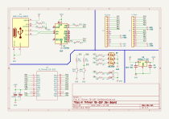

  
  
  
  

  <h1> AI Thinker TB-03F Development Board</h1>
      

# 🤖 Introduction 

Development Board Based On AI Thinker TB-03F.

## 🌴 Log
- 09 Desember 2024, First Schematic, Need Recheck
- 10 Desember 2024, Finish Component Layout
