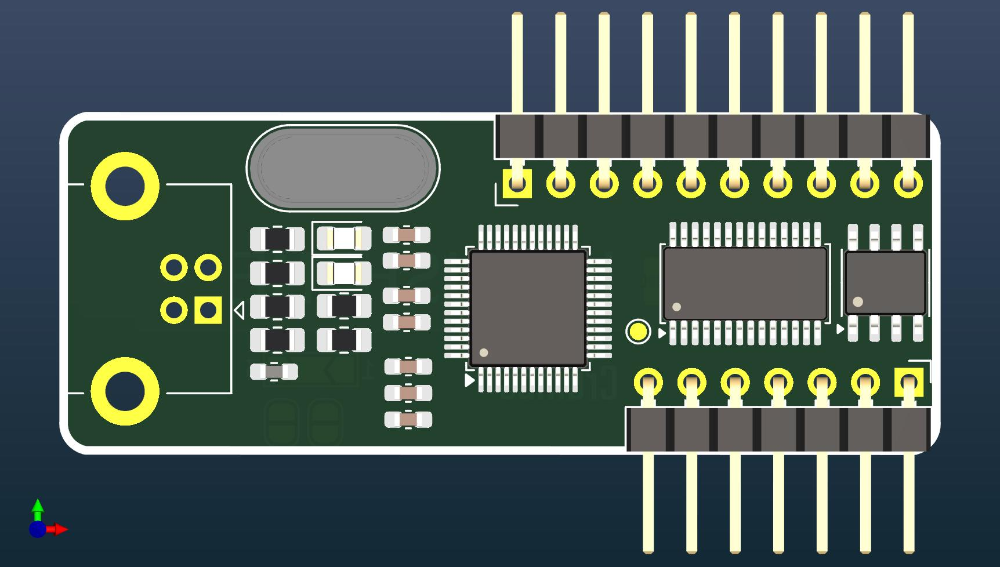

# 🏯 Hokushime 

Hokushime is project to clone Hirose USB to RS232 converter

**Used Component**
- SIPEX SP3243ECA (will use SP3243EB, 3 driver / 5 receiver RS-232 transceiver)
- FT232BL (will use FT232BL, FT232B is a USB to serial UART)
- ATMLH916 (will use AT93C66, Microwire EEPROM IC)


## Logs 

- 11 June 2025, Component arrived, 
- 12 June 2025, Drill and cut pcb 

## Notes 

- FT232 Family

**FT232BL** is newer version of **FT232BM**
  
```shell
Feature	FT232BL	FT232RL	FT230X	FT232H
USB Support	USB 2.0 FS	USB 2.0 FS	USB 2.0 FS	USB 2.0 HS
UART	Yes	Yes	Yes	Yes
SPI/I²C/JTAG	No	No	No	Yes (MPSSE)
EEPROM Support	External	Internal	Internal	Internal
Integrated Xtal	No	Yes	Yes	Yes
Voltage I/O	3.3V / 5V	3.3V / 5V	3.3V / 5V	3.3V
Packages	SSOP28, etc.	SSOP28, QFN	QFN, DFN	LQFP, QFN
Channels	1	1	1	1 (multi-mode)
Misc Features	Basic UART	Full USB-UART	Lower cost	Advanced, MPSSE
```

| Feature                | FT232BM         | FT232BL         | FT232RL         | FT232RQ         | FT232H             |
|------------------------|------------------|------------------|------------------|------------------|----------------------|
| USB Version            | USB 1.1          | USB 2.0 FS       | USB 2.0 FS       | USB 2.0 FS       | USB 2.0 HS           |
| Max Baud Rate          | 1 Mbps           | 3 Mbps           | 3 Mbps           | 3 Mbps           | 12 Mbps              |
| Package                | SSOP28           | SSOP28           | SSOP28, QFN32    | QFN32            | QFN32, LQFP48        |
| Internal EEPROM        | ❌ No             | ❌ No             | ✅ Yes (128 B)    | ✅ Yes (128 B)    | ✅ Yes (configurable) |
| Internal Oscillator    | ❌ No             | ❌ No             | ✅ Yes            | ✅ Yes            | ✅ Yes                |
| Requires Crystal       | ✅ Yes (6 MHz)    | ✅ Yes (6 MHz)    | ❌ No             | ❌ No             | ❌ No                 |
| Voltage Supply         | 5V               | 5V               | 3.3V–5.25V       | 3.3V–5.25V       | 1.8V–5.25V           |
| IO Voltage             | 5V               | 5V               | 1.8V–3.3V (5V tolerant) | 1.8V–3.3V (5V tolerant) | 1.8V–3.3V (5V tolerant) |
| USB Battery Charging Detection | ❌ No      | ❌ No             | ✅ Yes            | ✅ Yes            | ✅ Yes                |
| Driver Support         | VCP, D2XX        | VCP, D2XX        | VCP, D2XX        | VCP, D2XX        | VCP, D2XX, MPSSE      |
| MPSSE (for SPI/I2C/JTAG) | ❌ No          | ❌ No             | ❌ No             | ❌ No             | ✅ Yes                |
| Target Application     | Basic USB-UART   | USB-UART         | USB-UART         | USB-UART         | USB Hi-Speed Serial / MPSSE |


- recomended minimum SP3243E Capacitor,
`The external capacitors can be as low as 0.1µF with a 16V breakdown voltage rating.`
```shell
Table 7: Minimum Recommended Charge Pump
Capacitor Value
Input Voltage VCC Charge Pump Capacitor Value
3.0V to 3.6V C1 - C4 = 0.1µF
4.5V to 5.5V C1 = 0.047µF, C2 - C4 = 0.33µF
3.0V to 5.5V C1 - C4 = 0.22µF
```

- There are two varieties of these EEPROM’s from many sources such as Microchip, STMicro, ISSI etc. – one is configured as being 16 bits wide, the other is configured as being 8 bits wide. The **FT232B requires EEPROMs with a 16-bit wide** configuration such as the Microchip 93LC46B device.
