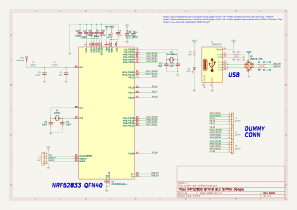

# BLE Sniffer NRF52833 QFN40 

It small AQFN package equivalent with less gpio, as far as research now this 
is firmware compitable but maybe not pin compitable because many pin is not 
exist in this QFN40 package. 

 

## Logs 

- 5 Agustus 2026, initializing hardware project 

