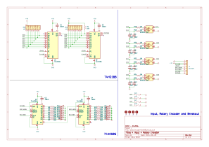

## Crumbs 🍪 - Rotary Encoder With 74HC595 And 74HC165

Simple Breakout Board to Learn Shift Register with Tactile Switch And Rotary Encoder 

### 🍑 Features
> 🎈 4 Rotary Encoder With Low Pass Filter Debounce  
> 🏀 4 Input  With Low Pass Filter Debounce  
> 🍨 Use 2x 74HC595  
> 🍛 Use 2x 74HC165

 27 Juni 2024 19:11 Work In Progress, Made with ♥️ by AH... 
